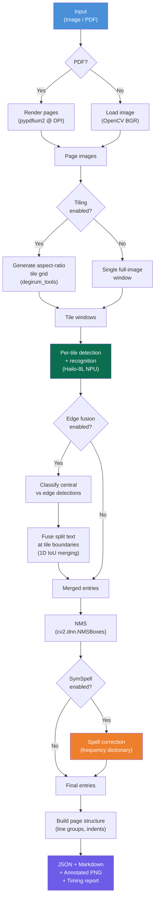
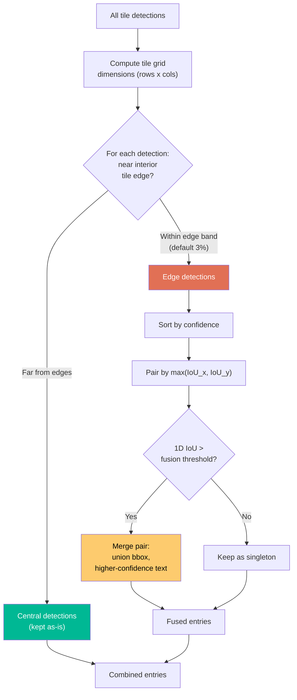
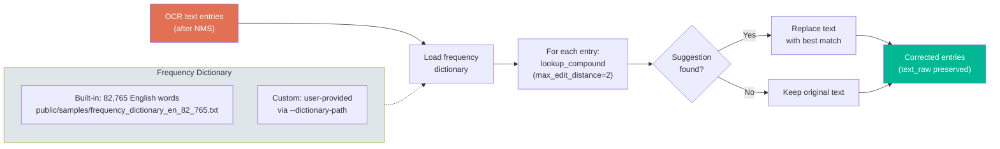
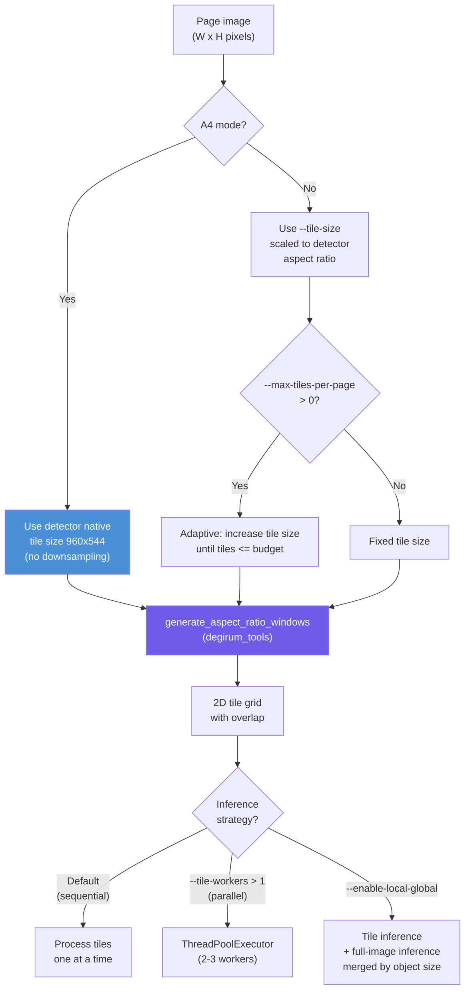

# Arcane OCR

[](https://www.raspberrypi.com/) [](https://hailo.ai/) [](https://www.python.org/) [](https://opencv.org/) [](https://pypi.org/project/pypdfium2/) [](https://github.com/wolfgarbe/SymSpell)

Hardware-accelerated OCR pipeline for Raspberry Pi + Hailo-8L NPU. Processes images and PDFs with PaddleOCR text detection and recognition models running on the Hailo-8L neural processing unit.

## Pipeline Overview

### End-to-End Flow



### Per-Tile Detection & Recognition

```mermaid
flowchart LR
    subgraph Detection["Text Detection (NPU)"]
        A1["Tile image"] --> A2["Letterbox pad\nto 544x960"]
        A2 --> A3["Detector HEF\n(PaddleOCR DB)"]
        A3 --> A4["Heatmap\n544x960x1"]
    end

    subgraph PostProcess["DB Postprocessing"]
        A4 --> B1["Binarize heatmap\n(thresh=0.3)"]
        B1 --> B2["Find contours\n+ polygon approx"]
        B2 --> B3["Unclip polygons\n(Vatti / pyclipper)"]
        B3 --> B4["Filter by area\n& confidence"]
        B4 --> B5["Warp-crop\ntext regions"]
    end

    subgraph Recognition["Text Recognition (NPU)"]
        B5 --> C1["Resize crops\nto 48x320"]
        C1 --> C2["Batch recognizer\nHEF (CTC)"]
        C2 --> C3["Argmax decode\n97-char set"]
        C3 --> C4["text + confidence\nper crop"]
    end

    C4 --> D["Map local bbox\nto global coords"]

    style A3 fill:#0b6e4f,color:#fff
    style C2 fill:#0b6e4f,color:#fff
```



### Edge Box Fusion Algorithm



### SymSpell Post-OCR Correction



### Tiling Strategies



## Features

- **NPU-accelerated inference** via Hailo-8L (PaddleOCR detection 544x960, recognition 48x320)
- **Aspect-ratio-aware tiling** using `degirum_tools` for proper 2D grid generation matching detector dimensions
- **Edge box fusion** to eliminate text duplication at tile boundaries (1D IoU-based merging)
- **OpenCV NMS** (`cv2.dnn.NMSBoxes`) for fast C++ duplicate suppression
- **Local+Global strategy** (opt-in) combining tile and full-image inference by object size
- **Multi-threaded tile inference** (opt-in) overlapping Python preprocessing with NPU inference
- **A4-optimized PDF mode** with DPI-based rendering and detector-native tiling
- **Structured output** with JSON (line groups, indent levels, bounding boxes) and Markdown hierarchy
- **Page combining** (opt-in) reconstructs document hierarchy across page boundaries with smart header filtering and section number detection
- **SymSpell text correction** with custom frequency dictionary support for post-OCR spelling fixes
- **Timing reports** with per-page and total runtime metrics

## Project Layout

```
arcane-ocr/
├── src/arcane_ocr/
│   ├── pipeline.py          # Main OCR pipeline entrypoint
│   ├── hailo_inference.py   # Hailo NPU async inference wrapper
│   ├── ocr_utils.py         # OCR decode/postprocess/visualization
│   └── db_postprocess.py    # PaddleOCR DB detector postprocessor
├── config/
│   └── ocr_config.yaml      # Model paths and runtime config
├── models/hailo8l/           # OCR HEF models for Hailo-8L
├── scripts/
│   ├── setup_venv.sh         # Create Python virtual environment
│   ├── install_hailo_runtime.sh  # Install Hailo runtime packages
│   ├── download_models.sh    # Download OCR HEF models
│   ├── check_installed_packages.sh  # Verify installation
│   └── run_ocr.sh            # Run OCR pipeline
├── public/
│   ├── images/               # Sample images
│   └── samples/              # Sample PDFs and frequency dictionary
├── setup-files/              # Local .deb/.whl runtime packages
├── output/                   # OCR outputs
└── docs/
    ├── DEVELOPER.md          # Architecture and development guide
    ├── USERGUIDE.md          # Usage instructions and profiles
    ├── PAGE_COMBINING.md     # Multi-page hierarchy reconstruction
    ├── PIPELINE_SETUP.md     # Full setup walkthrough
    └── OPTIMIZATION_GUIDE.md # Tiling strategies and tuning
```

## Quick Start

### 1. Set up environment

```bash
./scripts/setup_venv.sh
source .venv/bin/activate
./scripts/install_hailo_runtime.sh
./scripts/download_models.sh
./scripts/check_installed_packages.sh
```

### 2. Run OCR on an image

```bash
./scripts/run_ocr.sh \
  --input ./public/images/ocr_sample_image.png \
  --output-dir ./output/image_run
```

### 3. Run OCR on a PDF (recommended A4 mode)

```bash
./scripts/run_ocr.sh \
  --input ./public/samples/contents_page_sample.pdf \
  --output-dir ./output/pdf_run \
  --a4-mode \
  --pdf-dpi 200 \
  --tile-overlap-ratio 0.12 \
  --rec-batch-size 8
```

## Speed/Accuracy Profiles

| Profile | Use Case | Key Flags |
|---------|----------|-----------|
| Fast | Low latency | `--pdf-scale 2.0 --tile-size 1280 --max-tiles-per-page 6 --rec-batch-size 12` |
| A4-Optimized | PDF documents (recommended) | `--a4-mode --pdf-dpi 200 --rec-batch-size 8` |
| Balanced | General use | `--pdf-scale 2.5 --tile-size 1024 --max-tiles-per-page 9 --rec-batch-size 8` |
| Max Accuracy | Dense documents | `--pdf-scale 3.0 --tile-size 960 --tile-overlap-ratio 0.15 --rec-batch-size 4` |

Example commands:

```bash
# Fast
./scripts/run_ocr.sh --input doc.pdf --output-dir ./output/fast \
  --pdf-scale 2.0 --tile-size 1280 --tile-overlap-ratio 0.08 \
  --max-tiles-per-page 6 --rec-batch-size 12

# A4-Optimized (recommended for PDFs)
./scripts/run_ocr.sh --input doc.pdf --output-dir ./output/a4 \
  --a4-mode --pdf-dpi 200 --tile-overlap-ratio 0.12 --rec-batch-size 8

# Max Accuracy
./scripts/run_ocr.sh --input doc.pdf --output-dir ./output/maxacc \
  --pdf-scale 3.0 --tile-size 960 --tile-overlap-ratio 0.15 \
  --rec-batch-size 4 --nms-iou-threshold 0.45
```

## Advanced Features

### Edge Box Fusion (enabled by default)

Eliminates text duplication at tile boundaries by classifying detections as central or edge, then fusing split fragments using 1D IoU. Disable with `--disable-edge-fusion`.

```bash
# Tune fusion sensitivity
./scripts/run_ocr.sh --input doc.pdf --output-dir ./output/fused \
  --a4-mode --edge-threshold 0.03 --fusion-threshold 0.5
```

### Local+Global Strategy (opt-in)

Runs tile inference for small text detail and full-image inference for large objects (headers, titles). Merges by object area threshold.

```bash
./scripts/run_ocr.sh --input doc.pdf --output-dir ./output/localglobal \
  --a4-mode --enable-local-global --large-object-threshold 0.005
```

### Multi-threaded Tile Inference (opt-in)

Overlaps Python preprocessing with NPU inference using a thread pool. Keep workers at 2-3 since the Hailo accelerator serializes access.

```bash
./scripts/run_ocr.sh --input doc.pdf --output-dir ./output/parallel \
  --a4-mode --tile-workers 2
```

### SymSpell Post-OCR Correction

Corrects OCR spelling mistakes using SymSpell's `lookup_compound` with edit distance 2. Correction runs on all detected text entries after NMS deduplication, so JSON, Markdown, and annotated outputs all receive corrected text. The original raw OCR text is preserved in the `text_raw` field of each entry.

**Built-in dictionary:** `public/samples/frequency_dictionary_en_82_765.txt` (82,765 English words with frequency counts).

**Custom dictionary:** Supply your own frequency dictionary with `--dictionary-path` to handle domain-specific vocabulary. The file format is one entry per line: `word<tab>frequency_count`.

```bash
# Use built-in dictionary (default when corrector is enabled)
./scripts/run_ocr.sh --input doc.pdf --output-dir ./output/corrected \
  --a4-mode --use-corrector

# Use a custom frequency dictionary
./scripts/run_ocr.sh --input doc.pdf --output-dir ./output/corrected \
  --a4-mode --use-corrector \
  --dictionary-path ./public/samples/my_custom_dictionary.txt

# Disable correction entirely
./scripts/run_ocr.sh --input doc.pdf --output-dir ./output/raw \
  --a4-mode --disable-corrector
```

## Output

Each processed page produces:

- `<page>_ocr.png` — annotated image with detected regions and recognized text
- `<page>_structured.json` — line groups, indent levels, bounding boxes, confidence scores
- `<page>_structured.md` — markdown hierarchy preserving spatial layout
- `timing_report.json` — per-page and total runtime metrics

When SymSpell correction is enabled, each entry in the JSON output includes both `text` (corrected) and `text_raw` (original OCR output).

## Configuration

Default config in `config/ocr_config.yaml`:

```yaml
models:
  det_hef: ./models/hailo8l/ocr_det.hef
  rec_hef: ./models/hailo8l/ocr.hef
runtime:
  use_corrector: true
  dictionary_path: ./public/samples/frequency_dictionary_en_82_765.txt
```

Override at runtime:

```bash
./scripts/run_ocr.sh --input image.png \
  --det-hef ./models/hailo8l/ocr_det.hef \
  --rec-hef ./models/hailo8l/ocr.hef \
  --use-corrector \
  --dictionary-path ./path/to/custom_dictionary.txt
```

## Live NPU Verification

```bash
# Terminal A: start Hailo monitor
hailo monitor

# Terminal B: run OCR (HAILO_MONITOR=1 is set by default in run_ocr.sh)
./scripts/run_ocr.sh --input doc.pdf --output-dir ./output/test
```

## Documentation

- [User Guide](docs/USERGUIDE.md) — detailed usage, CLI reference, profiles, and examples
- [Developer Guide](docs/DEVELOPER.md) — architecture, code structure, and extension points
- [Pipeline Setup](docs/PIPELINE_SETUP.md) — full setup walkthrough and troubleshooting
- [Optimization Guide](docs/OPTIMIZATION_GUIDE.md) — tiling strategies, benchmarks, and tuning

## Notes

- Requires Hailo-8L compatible HEF models (not HAILO8)
- Supports `.png`, `.jpg`, `.jpeg`, `.bmp` images and `.pdf` files
- PDF pages are rendered and processed page-by-page
- HEF models are loaded at runtime, not permanently flashed to the chip
