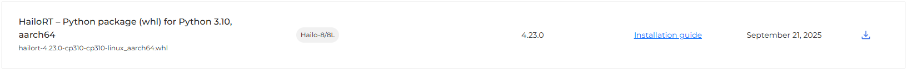
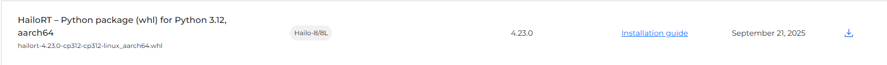

# Installation Instructions

Use this guide to prepare a Raspberry Pi OCR environment with local Hailo runtime artifacts.

Download the required files from:
https://hailo.ai/developer-zone/software-downloads/

Required packages:

1. TAPPAS Python Binding (`hailo_tappas_core_python_binding-5.2.0-py3-none-any.whl`)


2. TAPPAS Core Ubuntu package for arm64 (`hailo-tappas-core_5.2.0_arm64.deb`)


3. HailoRT PCIe driver Ubuntu package (`hailort-pcie-driver_4.23.0_all.deb`)


4. HailoRT Python wheel for your Python version (aarch64)
- Python 3.10: `hailort-4.23.0-cp310-cp310-linux_aarch64.whl`

- Python 3.11: `hailort-4.23.0-cp311-cp311-linux_aarch64.whl` (used in this project)

- Python 3.12: `hailort-4.23.0-cp312-cp312-linux_aarch64.whl`


5. HailoRT Ubuntu package for arm64 (`hailort_4.23.0_arm64.deb`)


After downloading, place all required `.deb` and `.whl` files in this folder (`setup-files/`) and run:

```bash
cd /home/rahul/Development/arcane-ocr
./scripts/setup_venv.sh
source .venv/bin/activate
./scripts/install_hailo_runtime.sh
./scripts/download_models.sh
```